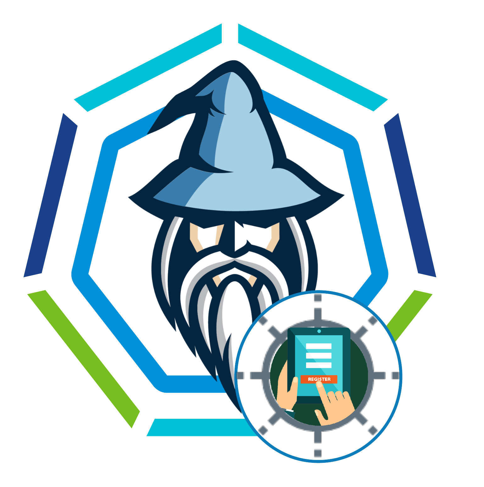

# TMC Registration



An easy "one click" way to complete TMC registration process.

## Steps:
- Get the TMC registration link generated from TMC
- Fill in the appropriate (TKGs or TKGm) .env file as necessary
- start this wizard using `start.sh` or `start.bat`

## Reuse:
*Reuse it for more times with different TMC registration link*
- Fill out the details in .env file for new registration (eg: endpoint, registration url etc)
- Remove `COMPLETE=YES` from .env file
- Change kubeconfig file for TKGm


## Pre-Requisites
Docker ce / ee  installed on host computer.

## Preparation

**.ssh (optional, only applicable when using bastion host with private cluster)**
- Place the 'id_rsa' file for ssh login into bastion host


**binaries**
- for vsphere with Tanzu (TKGS) cluster place kubectl-vsphere in this directory

**kubeconfig file**
- for TKGM clusters place the kubeconfig in .kube directory.

**.env**
Rename the .env.management.sample or .env.supervisor.sample to .env file (`mv .env.management.sample .env` or `mv .env.supervisor.sample .env`) and fill the below values

- TKG_SUPERVISOR_ENDPOINT=*<host name or ip endpoint of TKG supervisor cluster>*
OR
- TKG_MANAGEMENT_ENDPOINT=*<host name or ip endpoint of TKG management cluster>*
- BASTION_HOST=*<the ip or hostname of the bastion host to get to the supervisor cluster. IF no bastion is needed leave it blank>*
- BASTION_USERNAME=*<username for the bastion. IF no bastion is needed leave it blank>*
- TKG_VSPHERE_CLUSTER_USERNAME=*<username of vpshere user that has access>*
- TKG_VSPHERE_CLUSTER_PASSWORD=*<password for administrator@vsphere.local>*
- TMC_REGISTRATION_LINK=*<the URL obtained from TMC>*


## Start

- `chmod +x start.sh`
- `./start.sh` --> for linux/mac
- `start.bat` --> For windows

The build will build the docker container with all necessary dependancies.
The run will execute series of commands to process tmc registration. After the it finishes it will give shell access.


# That's it.
- The container will start with all necessary dependencies
- It will perform a series of automation that will complete regitration with TMC
- After it finished it's job it will give access to the pompt of the container where you would be able to do kubectl to the connected k8s.


## Essentially the below process is automated in this docker

**SSH into bastion (in the case when running in pvt cloud)**
`ssh -i .ssh/id_rsa ubuntu@10.79.142.40`


**login into tkg supervisor cluster (in bastion)**
```
kubectl vsphere login --insecure-skip-tls-verify --server 192.168.220.2 --vsphere-username administrator@vsphere.local
kubectl config use-context 192.168.220.2
```
**grab the tmc namespace name (begins with svc-tmc; in bastion)**
`kubectl get ns | grep svc-tmc`

**modify tmc-registration.yaml (in local machine/laptop)**
- with the svc-tmc-c1006 (or whichever the number is) 
- and the registration url from TMC console.

**copy the tmc-registration.yaml to the bastion for deployment**
`scp -i .ssh/id_rsa tmc-registration.yaml ubuntu@10.79.142.40:/home/ubuntu/ali/`

**deploy tmc-registration.yaml (in bastion)**
`kubectl create -f tmc-registration.yaml`

**to see progress (in bastion)**
`kubectl -n svc-tmc-c1006 describe agentinstall tmc-agent-installer-config`